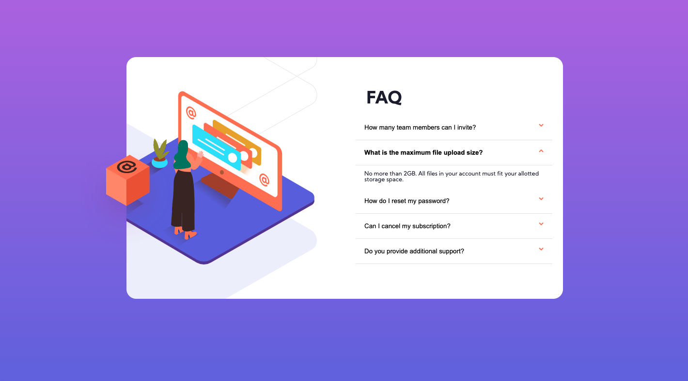
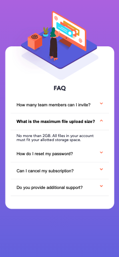

# Frontend Mentor - FAQ accordion card solution

This is a solution to the [FAQ accordion card challenge on Frontend Mentor](https://www.frontendmentor.io/challenges/faq-accordion-card-XlyjD0Oam). Frontend Mentor challenges help you improve your coding skills by building realistic projects. 

## Table of contents

- [Overview](#overview)
  - [The challenge](#the-challenge)
  - [Screenshot](#screenshot)
  - [Links](#links)
- [My process](#my-process)
  - [Built with](#built-with)
  - [What I learned](#what-i-learned)
  - [Continued development](#continued-development)
  - [Useful resources](#useful-resources)
- [Author](#author)


## Overview

### The challenge

Users should be able to:

- View the optimal layout for the component depending on their device's screen size
- See hover states for all interactive elements on the page
- Hide/Show the answer to a question when the question is clicked

### Screenshot





### Links

- Solution URL: [Add solution URL here](https://github.com/Rod-Barbosa/faq-accordion-card.git)
- Live Site URL: [Add live site URL here](https://your-live-site-url.com)

## My process

### Built with

- Semantic HTML5 markup
- CSS custom properties
- Flexbox
- CSS Grid
- JS script tag

### What I learned

The script tag should go at the end of the file.
```html
    <script src="myscripts.js"></script>

</body>
```

### Continued development

Eventually I need to get the handle of the position: absolute. Chances are, hihg paying clients won't care for something cool, thay will jsut want the design to behave the way it does in their heads.

### Useful resources

- [Accordeon FAQ](https://www.w3schools.com/howto/howto_js_accordion.asp) This one basically gives you the bones for the project

## Author

- Website - [Rodrigo Barbosa](https://gelatodigital.com)
- Frontend Mentor - [@Rod-Barbosa](https://www.frontendmentor.io/profile/Rod-Barbosa)


## Acknowledgments

I found this app for resizing the browser in http://serdar.work/
Suuuper helpfull
it ended up not being a short cut (it promises to make ctrl+shift+a do the trick) but the button to choose size is improvement enough
